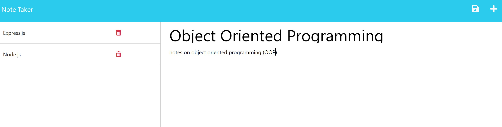
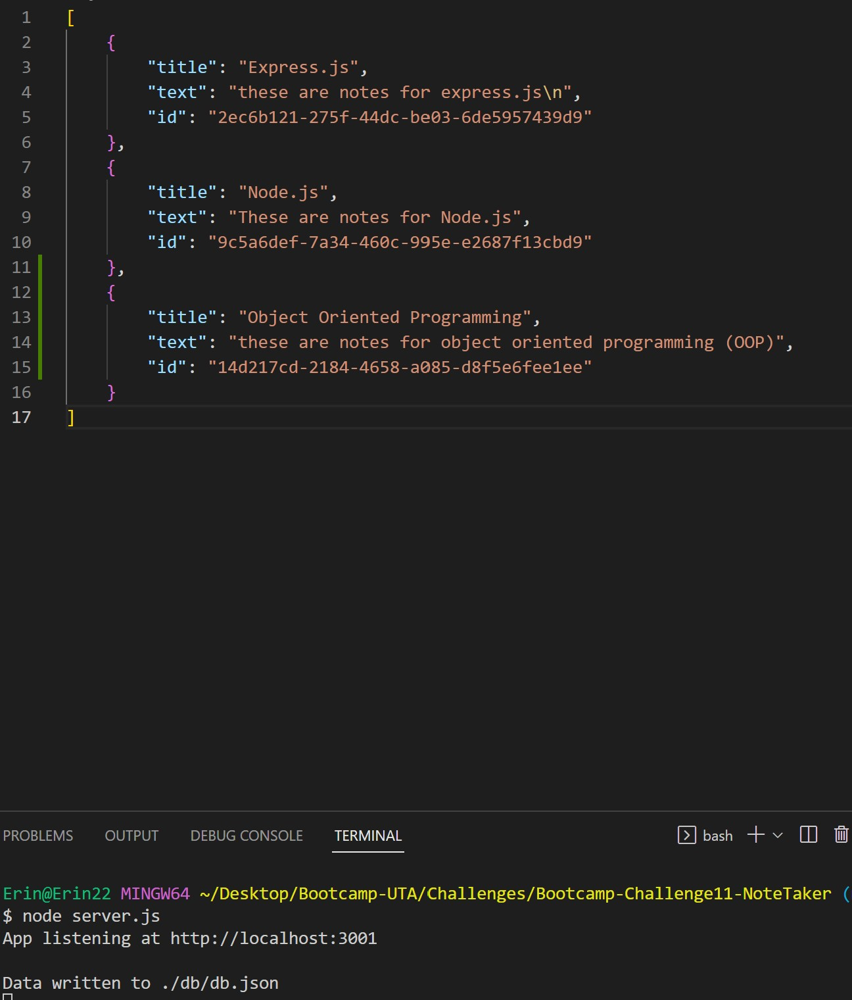

# Bootcamp-Challenge11-NoteTaker
UT Austin coding bootcamp challenge 11 - NoteTaker

## Description

This note taker app allows users to create notes that include a title and text content and save it to a database. They can click on previously saved notes to look back on them or they can click the "delete" button to remove them from the list (and subsequently the database). 

The following link is the deployed app on heroku:
https://bootcamp-challenge11-notetaker.herokuapp.com/

The following image shows an example of the Note Take app with saved notes:

The following image shows an example of the db that is populated with the saved notes: 

## Installation

N/A

## Usage

Upon loading the page, click "Get Started" button to go to the notes page. On this page users can:
* Create a new note by typing in a title and text where "Note Title" and "Note Text" appear on the right hand side. THEN click the "Save" button that appears at the top right
* See previously saved notes on the left hand column by clicking on the note title. To create a new note, user clicks on the "+" sign in the top right.
* Delete saved notes by clicking on the trashcan symbol

## Credits

Karen Peazzoni: https://github.com/kpeazzoni/

## License

Please refer to the LICENSE in the repo.